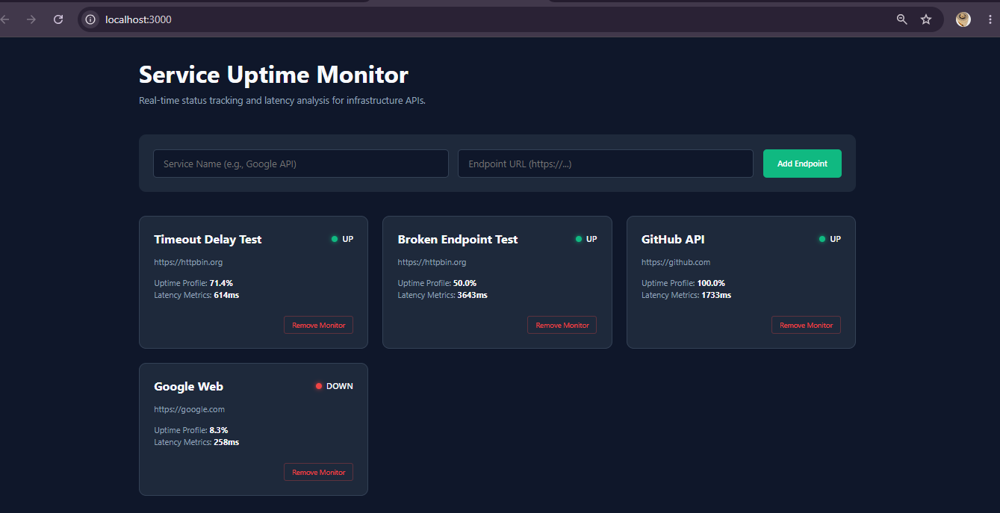

# 📈 MERN Stack Service Uptime & Performance Monitor

A lightweight, automated self-hosted alternative to UptimeRobot built using the MERN stack, strict TypeScript definitions, and modular Sass compilation. This system solves a universal infrastructure problem by continuously tracking API availability, monitoring system latency, and graphing historical service stability.

## 🚀 Live Visual Dashboard

<!-- Replace these placeholders with your actual asset file names -->



---

## 💡 Core Architecture & System Design

Unlike a standard CRUD project, this application runs **two parallel processing loops** inside the backend architecture:

1. **Express Rest API Layer:** Handles client CRUD communications, request filtering, and fast database updates.
2. **Automated Background Pinger Worker:** An isolated task scheduler that cycles through targets, evaluates server statuses, processes timeouts safely, and manages a rolling subdocument queue in MongoDB to compute uptime percentages dynamically.

### Key Technical Achievements

- **Decoupled Monorepo Structure:** Complete separation of backend database routines and modern frontend components.
- **Mongoose Pipeline Optimization:** Implemented a schema-level pre-save filter hook to limit tracking history to the 20 most recent checks, preventing database bloat.
- **Fault-Tolerant Networking:** Network checks feature custom `axios` request cancellation cutoffs to handle hanging or lagging servers without blocking subsequent pings.
- **Comprehensive Type Boundaries:** Built clear TypeScript interface mappings (`.tsx`) ensuring strict prop validity across frontend components.

---

## 🛠️ Technology Ecosystem

### Backend Architecture

- **Node.js & Express:** Application server framework.
- **MongoDB & Mongoose:** NoSQL database using embedded document schemas for high-speed rolling metrics logging.
- **Axios:** Network requests featuring explicit cancellation timeouts.
- **Nodemon & Dotenv:** Development state and environment management.

### Frontend Interface

- **React 19 & TypeScript:** Strict components, strict state validation, and declarative rendering rules.
- **Vite:** High-performance local development build tool.
- **Sass (SCSS):** Structured stylesheet architecture using variables, mixins, and custom layout frames.

---

## ⚙️ Local Configuration & Installation

### Prerequisites

- [Node.js](https://nodejs.org) installed locally (v18+ recommended).
- A running [MongoDB Community Server](https://mongodb.com) instance or a free [MongoDB Atlas](https://mongodb.com) cluster connection string.

### 1. Initialize the Backend Server

```bash
cd backend
npm install
```

Create a `.env` file inside the `backend` folder and populate it with your environment keys:

```env
PORT=5000
MONGO_URI=your_mongodb_connection_string
```

Start the development server loop:

```bash
npm run dev
```

### 2. Initialize the Frontend Dashboard

Open a secondary terminal workspace and configure the client bundle:

```bash
cd frontend
npm install
npm run dev
```

Open your browser and navigate to `http://localhost:3000` to interact with the monitor interface.
